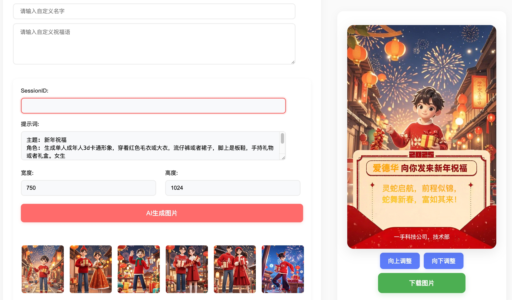

# 新年祝福海报生成器

感谢大佬分析：https://github.com/LLM-Red-Team/jimeng-free-api

支持即梦超强图像生成能力（目前官方每日赠送 60 积分，可生成 60 次），零配置部署，多路 token 支持。

## 目录

- [免责声明](#免责声明)
- [接入准备](#接入准备)
  - [多账号接入](#多账号接入)
- [效果展示](#效果展示)
- [Docker 部署](#Docker部署)
  - [Docker-compose 部署](#Docker-compose部署)
- [Render 部署](#Render部署)
- [Vercel 部署](#Vercel部署)
- [原生部署](#原生部署)
- [推荐使用客户端](#推荐使用客户端)
- [接口列表](#接口列表)
  - [对话补全](#对话补全)
  - [图像生成](#图像生成)

## 免责声明

**逆向 API 是不稳定的，建议前往即梦 AI 官方 https://jimeng.jianying.com/ 体验功能，避免封禁的风险。**

**本组织和个人不接受任何资金捐助和交易，此项目是纯粹研究交流学习性质！**

**仅限自用，禁止对外提供服务或商用，避免对官方造成服务压力，否则风险自担！**

**仅限自用，禁止对外提供服务或商用，避免对官方造成服务压力，否则风险自担！**

**仅限自用，禁止对外提供服务或商用，避免对官方造成服务压力，否则风险自担！**

## AI 生成图片准备
参考 https://github.com/LLM-Red-Team/jimeng-free-api 获取sessionid,并添加

